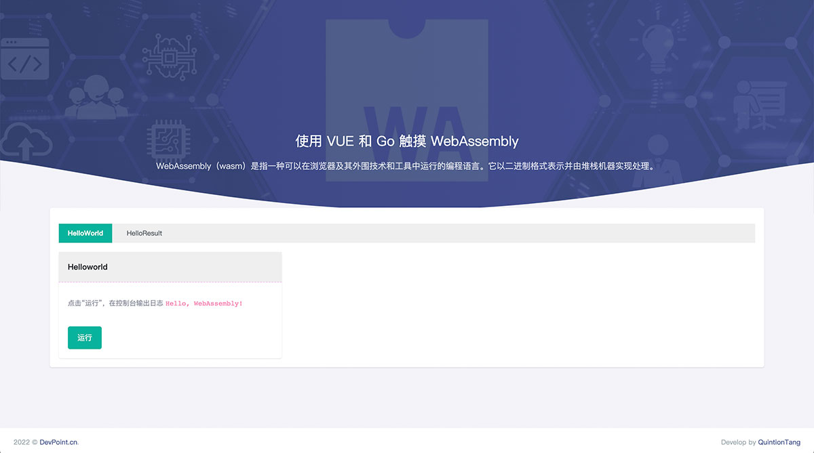

# GO-WebAssembly

本文将展示如何在 Go 中使用 WebAssembly。本文一起来学习如何从 Go 代码构建到 WebAssembly，通过 VUE 来展示使用 WebAssembly 的 API。

### 开始

#### vue

为前端相关部分

#### Golang

##### helloworld

第一个 Go WebAssembly 示例

##### helloresult

Go 与前端交互的 示例

### 个人自媒体

-   个人网站：https://www.devpoint.cn/index.shtml
-   infoQ：https://www.infoq.cn/u/devpoint/
-   掘金：https://juejin.cn/user/4406498333033918
